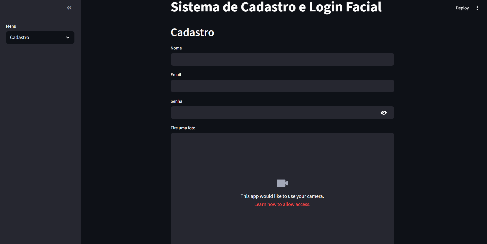
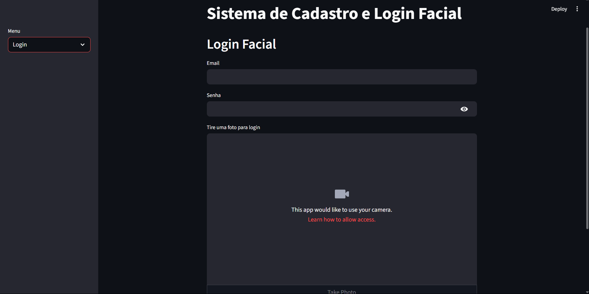

# Projeto Reconhecimento Facial com FastAPI, DeepFace e Streamlit

Este projeto é um sistema simples de cadastro e login facial com e-mail e senha, usando:

- **FastAPI** para a API backend
- **DeepFace (Facenet)** para extração de embeddings faciais (IA)
- **ChromaDB** para armazenamento vetorial dos embeddings
- **Streamlit** para dashboard frontend com webcam
- **Docker** para containerização

---

## Objetivo do Projeto
Criar um sistema simples de cadastro e autenticação facial usando inteligência artificial para extração de características faciais. O objetivo é permitir login seguro por meio de reconhecimento facial com autenticação tradicional (e-mail e senha).

---

## Funcionalidades

- Cadastro de usuário com nome, e-mail, senha e foto facial
- Login com e-mail, senha e foto tirada da webcam
- Reconhecimento facial via comparação de embeddings com IA
- Armazenamento persistente dos dados faciais e metadados

---

## Requisitos

- Docker (para rodar em container) ou Python 3.10+
- GPU opcional para acelerar DeepFace (pode rodar em CPU)
- Conexão com internet (para baixar modelos do DeepFace)

---

## Rodando localmente (sem Docker)

1. Clone o repositório:

```bash
git clone <seu-repositorio-url>
cd <nome-do-projeto>
```

2. Crie e ative um ambiente virtual:

```bash
python -m venv .venv
source .venv/bin/activate  # Linux/Mac
.venv\Scripts\activate     # Windows
```

3. Instale dependências:

```bash
pip install -r requirements.txt
```

4. Rode a API:

```bash
uvicorn main:app --reload
```

5. Em outra aba, rode o frontend Streamlit:

```bash
streamlit run dashboard.py
```

---

## Rodando com Docker

1. Build da imagem:

```bash
docker build -t facial-login-app .
```

2. Rodar container:

```bash
docker run -p 8501:8501 facial-login-app
```

3. Abra no navegador:

```bash
http://localhost:8501
```

---

## Estrutura do Projeto

├── app/   
      ├── models/
              ├── __init__.py
              └── user_model.py
      ├── routes/
              ├── __init__.py
              └── user_routes.py
      ├── services/
              ├── __init__.py
              ├── chroma_service.py
              ├── face_service.py
              └── password_service.py
      ├── utils/
              ├── __init__.py
              └── image_utils.py
      ├── __init__.py
      └── main.py
├── imagens/  
      ├── cadastro.png
      └── login.png
├── web/  
      └── streamlit_app.py
├── Dockerfile  
├── README.md   
├── docker-compose.yml       
└── requirements.txt           

---

## Dependências principais

- fastapi
- uvicorn
- deepface
- numpy
- chromadb
- streamlit
- python-multipart

---
## Tela de Cadastro


## Tela de Login


---

## Autores
- GUSTAVO JUNIO FERREIRA RODRIGUES | gustavo.2149337@discente.uemg.br
- KAUAN ALEXANDRE DIAS SILVA | kauan.2148893@discente.uemg.br
- SANTIAGO PAIVA ROSA BORGES | santiago.2148900@discente.uemg.br
- THIAGO ALVES RAMOS OLIVEIRA | thiago.2198859@discente.uemg.br
